## csapp

4.19

4.24

- a) 插C后面
- b) 插B和D后面

[课件](D:\hgs-3-2\计算机系统\课上\第5章-优化-to student.pdf)

## B站：

### 第一章 计算机系统漫游

预处理(hello.i)-编译(hello.s)-汇编(hello.o)-链接(hello)

Reasons（为什么要了解）:

- 优化程序性能
- 理解链接时出现的错误
- 避免安全漏洞

计算机系统硬件组成：

> 

操作系统：

> 
>
> 
>
> 
>
> 

一切皆为文件：

Amdahl's Law

当我们对系统的某一部分进行加速时，被加速部分的重要性和加速程度是影响整体系统性能的关键因素

加速比$S=T_{old}/T_{new}=\frac{1}{(1-\alpha)+\alpha/k}$

$若\alpha=0.6,k=3\ 则S=\frac{1}{(1-0.6)+0.6/3}=1.67$

$k\rightarrow+\infty, S=\frac1{1-\alpha}=\frac1{1-0.6}=2.5$

所以想要获得更高的加速比，必须加速大部分组件

- 线程级并发
- 指令级并行
- 单指令，多数据并行

### 第二章 数的表示

#### 1. 信息的存储

十进制→十六进制

**32位与64位**

64位做了向后兼容，所以上述的hello32既可以运行在32位机器上，也可以运行在64位机器上

**大端法与小端法：**

**字符串表示**

最后一个字符为null，即0x00

**移位**：

右移：

- 逻辑右移（无符号数）：补0
- 算术右移（有符号数）：补最高位

#### 2. 整数的表示

在64位机器上，long占8字节；在32位机器上，long占4字节

**有符号数**

- 补码：$-2^{n-1}$  ~  $2^{n-1}-1$

- 隐式转换：有符号数→无符号数

  

**类型转换**

- 无符号数
  - 小变大：零扩展
  - 大变小：只保留低位
- 有符号数
  - 小变大：符号扩展
  - 大变小：先保留低位，重新解读，再将其转化为有符号数

#### 3. 整数的运算

溢出检测（x+y）：

- 无符号数相加：sum需要大于x或y

- 补码相加：

  - 正溢出：两个非负数相加，得到结果为负
  - 负溢出：两个非正数相加，得到结果为正

  

**减法**：逆元

**乘法**：

- 无符号数：结果会截断：$(x\times y)mod\ 2^w $

- 有符号数：先转化为补码，然后与上述一致

  

- 编译器试图用移位、加法、减法来代替乘法

  

**除法**（除以$2^k$）：右移+朝0舍入

- 无符号数除法

- 补码除法

  - 负数时，可能不是向零舍入，所以需要加一个偏置

    

    

    

#### 4. 浮点数

**IEEE**

##### 4.1 浮点数类型

**其中阶码的值决定了这个数属于其中哪一类：**

1. 规格化的值：阶码不全为0，也不全为1
2. 非规格化的值：阶码全为0
3. 特殊值：阶码全为1
   1. 无穷大或无穷小
   2. “不是一个数”

##### 4.2 规格化数

- 阶码e: 1-254
  - e = E + bias
    - 单精度：bias=$2^{8-1}-1$=127; 所以$E_{min}=-126,E_{max}=127$
    - 双精度：bias=$2^{11-1}-1$=1023
- 尾数: M=1+f
- 

##### 4.3 非规格化数

阶码全0

- 数字0：
  - +0：s=0，M=f=0
  - -0：s=1，M=f=0
- 表示很接近0的数：
  - E = 1 - bias
  - M = f
  - 注意与规格化数的解释不同
- 

##### 4.4 特殊值

阶码全1

- 正无穷大：符号位为0，尾数全0
- 负无穷大：符号位为1，尾数全0
- “不是一个数”：尾数不为0

##### 4.5 例

##### 4.6 舍入

- 向上舍入

- 向下舍入

- 向零舍入

- 向偶数舍入：向近舍，一样近时使最低有效位为偶数

  

|    转换前    | 转换后 |                      |
| :----------: | :----: | :------------------: |
|     int      | float  | 不会溢出，可能会舍入 |
|  int/float   | double |  不会溢出也不会舍入  |
|    double    | float  | 可能溢出，也可能舍入 |
| float/double |  int   |  向0舍入，或者溢出   |

##### 4.7 浮点数加法和乘法不具有结合性和分配性

### 第三章 程序的机器级表示

目的操作数不能是立即数

#### 1. 基础

[通用寄存器](https://blog.csdn.net/qq_34908601/article/details/123772569)

**调用者保存寄存器和被调用者保存寄存器**

- 
- 
- 

**Intel 数据类型**

- 一个word16位
- 

#### 2. 寄存器与数据传送指令

[通用寄存器](https://blog.csdn.net/qq_34908601/article/details/123772569)

**内存引用**

**数据传送指令**：

- x86-64处理器的限制：源操作数和目的操作数**不能都是内存引用**；

- 

- movq中源操作数是立即数时，只能是32位补码

  

- movabsq指令的源操作数可以是任意的64位立即数，目的只能是寄存器

- x86-64处理器规定：当movl的目的操作时是寄存器时，会把该寄存器的**高4字节设置为0**

- 源操作时数位小于目的操作数时：

  - 0扩展：

    

    以movzbw为例，z表示0扩展，b表示源操作数大小，w表示目的操作数大小

  - 符号位扩展

    

    以movsbw为例，s表示符号位扩展，b表示源操作数大小，w表示目的操作数大小

#### 3. 算术和逻辑运算指令

- leaq：加载有效地址（仅仅是计算地址，注意与mov指令区分）

  - 
  - 无论是mov还是leaq，比例因子的取值均只能是1，2，4，8四个数中的一个

- 一元操作：只有一个操作数

  

- 二元操作

  

- 移位操作

  

  - 对于移位量k，可以是一个立即数，或者是放在寄存器cl中的数（一个字节）

    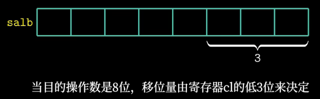

  - 

- 其它

  

#### 4. 指令与条件码

- 条件码寄存器

  - CF：有进位时置一
  - ZF：结果为0时置一
  - SF：符号标志，结果小于0时置一
  - OF：溢出标志，针对有符号数，溢出时置一

  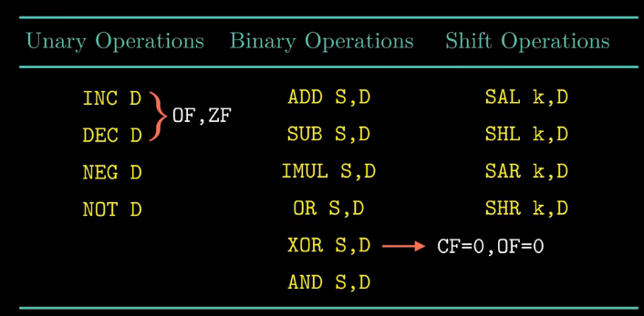

  此外，还有cmp指令和test指令也可以设置条件码寄存器

  - cmp指令：也是做差，但只会更新条件码，不会更新目的寄存器
  - test指令：和and指令类似，但只会设置条件码寄存器

  

  

- 根据条件码判断大小

  - 有符号数：

    

  - 无符号数：

    

#### 5. 跳转指令与循环

使用条件传送指令比使用跳转指令性能高

- do-while
- while
- for
- switch：通过跳转表的数据结构，使得实现更加高效；与一大串if-else相比，使用跳转表的优点是执行switch语句的时间与case的数量无关

#### 6. 过程（函数调用）

- 参数1~6的传递用寄存器，参数7及后续参数用栈传递

  

- 栈中传递的参数需要8字节对齐，而局部变量不需要对齐

  

- 除了rsp外，其它15个寄存器分别被定义为调用者保存和被调用者保存

#### 7. 数组的分配与访问

#### 8. 结构体与联合体

- 数据对齐

  **<u>对于占K个字节的数据类型，起始地址必须是K的倍数</u>**

  

  同时还得考虑**<u>结构体数组</u>**的情况，如上述成员变量顺序即使写为 int i; int j; char c; 也还是需要12字节。

  （**<u>结构体的K是结构体中所有成员的K值中最大的值</u>**）

  

- 联合体：不同字段是互斥的

  **<u>联合体的大小取决于它最大字段的大小</u>**

  

  存在问题：无法确定一个节点到底是内部节点还是叶子节点

  拒绝方法：引入一个枚举类型

  

  上述中联合体的K为8

- 联合体 位模式

  

#### 9. 缓冲区溢出

对抗缓冲区溢出攻击

- 栈随机化

  - 每次运行相同的代码，栈地址是不同的；在Linux系统中栈随机化已经是一种标准行为（地址空间布局随机化ASLR）

- 栈破环检测（如金丝雀）

  - 在函数被调用之后，立即在栈帧中插入一个[随机数](https://so.csdn.net/so/search?q=随机数&spm=1001.2101.3001.7020)，函数执行完在返回之前，程序通过检查这个随机数是否改变来判断是否存在栈溢出

    

    %fs:40是一个内存地址，是只读的，所以攻击者无法修改金丝雀值

- 限制可执行代码区域

  - 可读、可写、可执行

### 第四章 处理器体系结构

#### 1. 指令系统结构

**Y86-64指令系统**

小端法

- 相较于X86-64，少了一个r15寄存器，主要是为例降低指令编码的复杂度

  

- 仅保留了3个条件码，分别为ZF、OF、SF

  > 

- 传送指令：

  

- 整数操作指令：

  

- 跳转指令

  

- 条件传送指令

  

- halt：指令码和功能码均为0，表示停止

- nop：指令码为1，功能码为0，表示空操作

- 函数调用：

  

- 异常：

  

  遇到异常时简单地让程序停止执行指令

#### 2. 数字电路与处理器设计

- 寄存器文件

  

  - 存储元件为D触发器

#### 3. Y86-64的顺序实现

- 指令大小：1~10字节不等

  

- 六个阶段

  

  - 译码阶段（读寄存器）：寄存器文件有两个读端口，可以支持同时进行两个读操作

  - 执行阶段：

    

- 执行例子：

  

  

  

  

  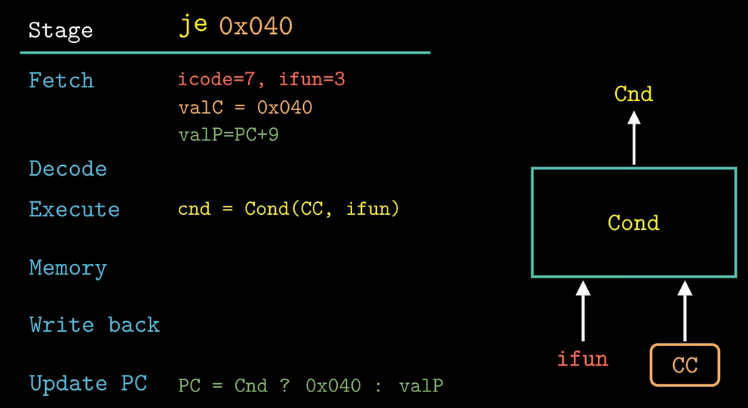

**Cnd** **=** **Cond(CC,ifun)**

#### 4. Y86-64处理器硬件结构

上述操作需要在一个时钟周期内完成

- 取指：一次性会取10字节，这样才可以保证一次取指操作至少可以获得一条完整的Y86-64指令

  

  valC也需要通过Need regids来判断valC是2-9字节还是3-10字节

- 译码：

  

- 执行：

  

  - 图中Set_CC会根据指令代码icode来控制是否需要更新条件码寄存器（只在指向算术逻辑时才设置）

- 访存：

  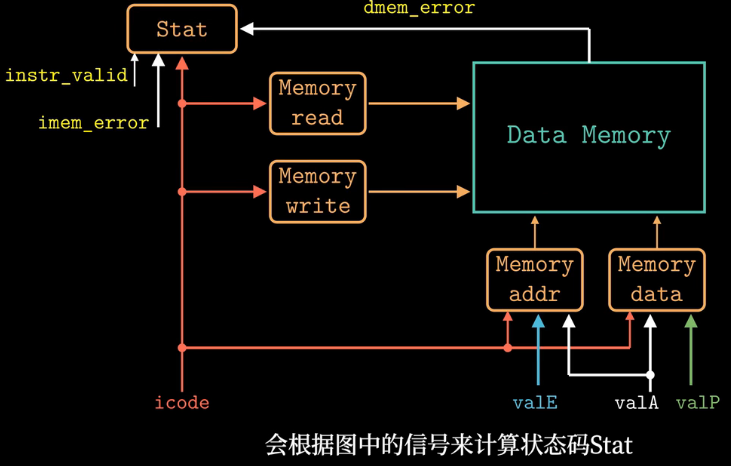

  - 会设置状态码

- 写回：

  

- 更新PC：

  

|  阶段  |                          需要干的事                          |
| :----: | :----------------------------------------------------------: |
|  取指  | 指令码icode、功能码ifun、寄存器编号rA/rB、立即数valC、下一地址valP |
|  译码  |                 读取寄存器valA、valB （rsp）                 |
|  执行  |              计算结果valE、 cnd=Cond(CC, ifun)               |
|  访存  |                            M[]=*                             |
|  写回  |                   R[%]=* cnd、（条件传送）                   |
| 更新PC |                       PC=valP （Cnd）                        |

#### 5. 流水线的通用原理

- 局限性：
  - 吞吐量有延迟最大的阶段决定
  - 虽然增加流水线的阶段数可以增加系统的吞吐量，但是过深的流水线同样会导致系统性能的下降。
- 依赖
  - 数据依赖
  - 控制依赖

#### 6. 流水线硬件结构

将更新模块移到前面，变为5阶段流水线

#### 7. 数据冒险

- 暂停 （插入气泡）

  

  效率低

- 转发（旁路）

  

  还有一种情况无法解决——**加载使用型冒险**

  

  在译码阶段插入一个气泡，然后访存后通过旁路传递数据

#### 8. 控制冒险

无法在取指阶段获得下一指令地址——控制冒险：

- ret指令

  

- 分支条件指令（分支预测）

  发现错误后插入气泡，清除两条不应该被执行的指令

  

  

**数字冒险中的暂停是等别人处理完，ret中的暂停是等自己处理完，分支跳转指令中则是清除**

**暂停信号和气泡信号：**

- 流水线正常执行：暂停信号和气泡信号均为0
- 暂停流水线：暂停信号为1。即使上升沿寄存器也保持不变，实现将指令阻塞在某个阶段中
- 插入气泡：气泡信号为1。寄存器状态设置为某个固定的复位配置（等效于指令nop）

#### 9. Y86-64的流水实现

- 取指	

  - 顺序执行：更新PC为：PC+指令长度、 ret
  - 跳转执行：call j

- 译码

  

  - 不一定要从寄存器文件中读取，也可能是数据转发
  - 五个转发源：两个E（valE），两个M（valM），一个W（valE,valM）; 越近越优先
  - valP和valA可以合并，因为valP只会在跳转指令和call指令用到，而这两条指令不会用到valA

#### 10. 流水线的控制逻辑

- 加载-使用型冒险

  

  - mrmovq、popq
  - F和D暂停，在E插入bubble

- 分支预测错误

  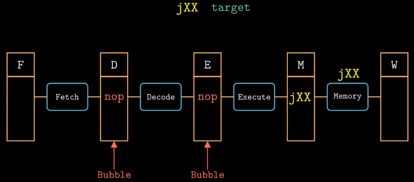

  - 向流水线D和E中插入气泡

- ret

  

  - 在D中插入3次bubble，F暂停

**暂停就是保持流水线寄存器的状态不改变**

**插入气泡就是将寄存器状态做一次类似清0的操作**

##### (1) 组合冒险

**跳转指令与ret指令的组合冒险：**

- 默认预测跳转，但实际不会跳转，因此我们期望执行的指令是irmovq，而不是返回指令
- 
- F暂停，D和E插入气泡

**加载/使用指令与ret指令的组合冒险：**

- 

##### (2) 流水线性能

$\frac{C_b}{C_i}$表示每个指令平均要插入多少个气泡

### 第五章 优化

#### 1. 优化程序性能

- 选择合适的算法和数据结构
- 编译器的能力和局限性
- 探索并行化

##### 妨碍优化的两个因素：

- 内存别名引用
- 函数调用

**内存别名引用例子**：

考虑xp和yp指向相同位置（内存别名引用）的情况：（上述两种方法执行的结果不同）

因此，不能用函数add2的代码作为函数add1的优化版本

通过这个例子可以看出，如果编译器无法确定两个指针是否指向同一个位置，那么编译器就会假设所有的情况都有可能发生，这就限制了可能的优化策略

**函数调用例子**：

##### 如何表示程序性能

- 循环展开：如计算累积和

  - 

  - 优化：

    

  - 性能

    

- **CPE**：每个元素执行所需要的周期数，psum2的CPE为6.0；psum1的CPE为9.0

##### 如何优化程序性能

例：

未优化代码时：

- 优化1：（代码移动）先获取length，减少函数提升性能

  

- 优化2：先获取数组基地址

  

  发现用处不大

- 优化3：减少dest内存引用，增设一个临时变量

  

- 优化结果：

  

#### 2.理解现代处理器

##### 指令集并行

处理器进一步分为多个模块，**现代处理器（超标量处理器）每个时钟周期可以执行多个操作，且是乱序执行的**，整个设计分为两部分：指令控制单元和执行单元

- ICU

  

- EU

  如`addq %rax 8(%rdx)`会被分解为读、加法、写三个操作，读操作由加载单元执行，写操作由存储单元执行，然后处理器的执行单元就可以并行地执行多条指令的不同部分

##### Intel Core i7 Haswell

有8个功能单元，编号为0~7

整数操作包括加、位级操作和移位

**退役单元**：包含寄存器文件，同时控制着寄存器的更新，指令在译码时，指令的相关信息被放置在一个先进先出的队列中，这些信息会一直保持在队列中，直到发生以下两种情况中的一个：

- 当一条指令的操作完成了，而且所有引起这条指令的分支点也都被确认为预测正确，所有对程序寄存器的更新也可以执行了；
- 另一个方面，如果引起该指令的某个分支点预测错误，也就是说这条指令不应该被执行，那么这条指令会被清空，丢弃所有计算出来的结果，通过这种方法，即使发生预测错误也不会改变程序的状态

**功能单元的性能：**

#### 3. 数据流图

**延迟界限**：相当于当个功能单元运行需要的CPE

**吞吐量界限**：多个功能单元执行、乱序。是**最低界限**

#### 4. 循环展开

如之前说的 psum2 

- 首先，循环展开可以减少与程序结果无关操作的数量
- 其次，能够减少整个计算中关键路径的操作数量

循环展开：

- 优化1：每次执行两次操作

  - 

  - 即使每次执行3次操作也无法超过延迟界限

    

    why：存在依赖

- 优化2：每次执行两次操作，但并行。（$2\times2$循环展开）

  - 

  - 

  - 随着k值增大，所有的CPE都有所改进

    

    但k增大到10，程序的性能接近吞吐量界限

- 优化3：调整括号位置。（**重新结合变换**）

  - 

  - 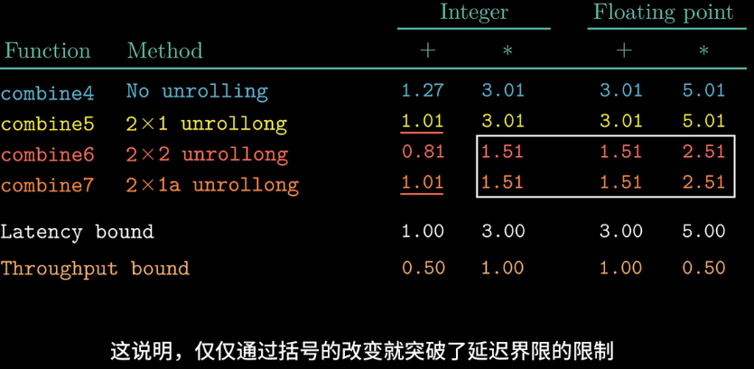

    why：减少了依赖

#### 5. 理解内存性能

在combine6中，k为10之后继续增加路数，执行结果并不会更好，甚至可能下降。随着k增大，累积变量的值不是保存在寄存器中，而保存在栈上，因此程序需要从内存中读取

不过幸运的是，大多数循环在出现寄存器溢出之前就已经达到吞吐量界限了

##### 加载性能（内存→寄存器）

上述操作CPE为4，与访问L1 cache的延迟接近

##### 存储性能（寄存器→内存）

#### 6. 总结

优化方法：

- 高级设计
  - 针对具体的问题选择适当的算法和数据结构
- 基本编码原则
  - 消除连续的函数调用以及消除不必要的内存引用
- 低级优化
  - 根据硬件设计，利用循环展开等技术提高指令级并行

### 第六章 储存

#### 1. 储存技术

Random Access Memory（随机访问存储器）需要有电才能保持数据

- Static RAM（静态 RAM，SRAM），每个单位对应6个晶体管（双稳态）
- Dynamic RAM（动态 RAM，DRAM），每个单元对应一个电容和一个晶体管

每一个小格子有8bit

同步DRAM比异步的速度更快

#### 2. 机械磁盘

- 磁盘-盘片-盘面-磁道-扇区

- 磁盘访问时间

  - 寻道时间

  - 旋转时间

  - 传输时间

- 

#### 3. 固态硬盘

写是以page为单位，擦除是以块为单位，每次擦除会有磨损， 闪存翻译层中的平均磨损逻辑试图通过将擦除平均分布在所有块上来最大化每个块的寿命

> 

缓存不命中的种类有: **冷（强制）不命中、 冲突不命中、容量不命中**。

#### 4. Cache

为什么要用中间的位作为组索引：主要Cache会有更多的块被利用

**三个步骤：**

- 组选择
- 行匹配：有效位为1且tag相等→命中或不命中
- 字抽取

**三种映射：**

- 直接映射

  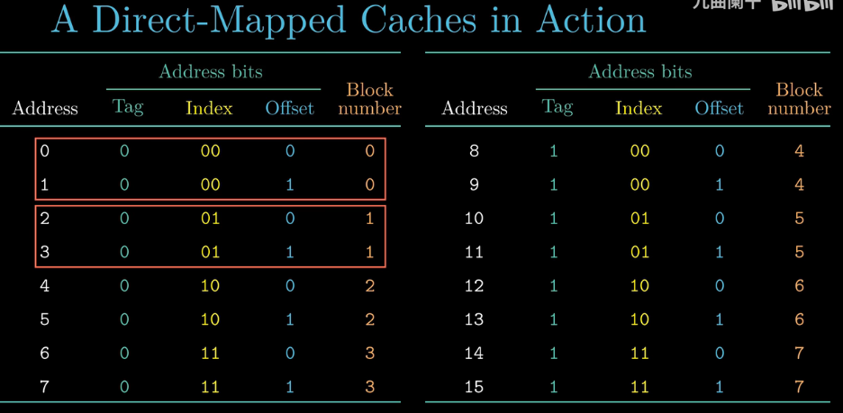

  8个块，但index只有2位，因此会发生冲突不命中

  程序员可以利用填充的方式，将两段内存映射到不同的set，从而消除抖动，解决冲突不命中的问题

- 组相联

  不命中时且没有空行的替换策略

  - 随机替换
  - LFU（最不常使用）
  - LRU（最近最少使用）

- 全相联

  只有一个set，不需要组选择

**写操作：**

- 写命中
  - 写穿透：写cache时写内存
  - 写回：只写cache，替换时再写内存
- 写不命中
  - 写分配：先将对应块加载到cache中，然后再写
  - 写不分配：直接写内存

**Intel Core i7：**

- 容量大：提高命中率，但增加命中时间
- 数据块大小：空间局部性提高命中率，时间局部性命中率降低；块大在不命中时开销较大
- 相联度
- 写策略

### 第七章 链接

#### 1. 编译

链接：

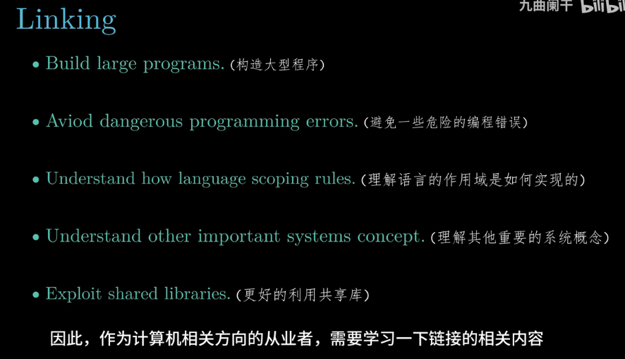

#### 2. 可重定位目标文件

wc表示word count

**各个段：**

- text：代码
- data：全局遍历和静态变量
- bss：未初始化的静态变量，初始化为0的全局变量和静态变量。实际上bss不占空间，只是占位符，所以bss段和rodata段的起始地址是一样的
- rodata：只读数据

#### 3. 符合和符号表

查看符号表：readelf -s main.o

- 变量和符号表中的类型都用OBJECT表示
- COM（COMMON）：和bss的区别很小
  - COMMON：未初始化的全局变量
  - .bss：未初始化的静态变量，初始化为0的全局或静态变量

- static有点像是私有的意思
- 全局符号：由该模块定义，同时能被其他模块引用的全局符号
- 外部符号：由其他模块定义，由该模块使用
- 局部符号：带有static，由本模块声明和使用

#### 4. 符号解析与静态库

如果多个可重定位文件中定义了同名的全局符号，此时应该如何处理：

- 强符号：函数和已初始化的全局变量
- 弱符号：未初始化的全局变量

三个规则：

- 多个同名强符号同时出现：

  - 

    main被定义了两次→报错

  - 

    x，报错

- 一个强符号和多个同名弱符号同时出现：

  - 
  - 选强的，不会报错，但main函数的作者可能会感到诧异，为什么x被修改为15212

- 多个弱符号同时出现：

  - 

    任一个

- 类型不同

  

  为了避免这类错误，可以在编译时添加-fno-common的编译选项，当遇到多重定义的全局符号时，触发一个错误；或-Werror选项，这个选项会把所有警告都变为错误

**链接器如何使用静态库：**

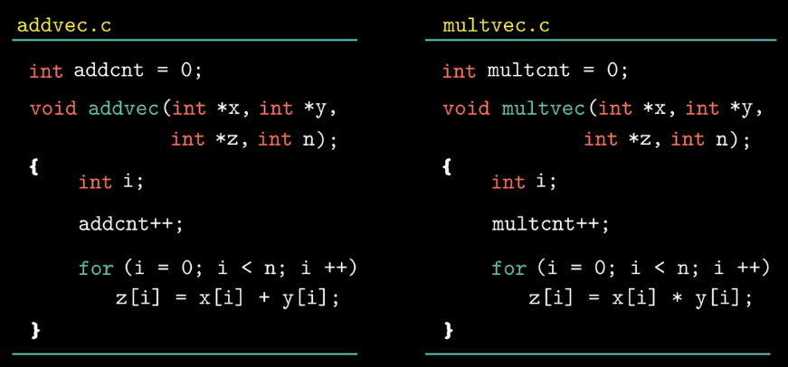

- gcc -c addvec.c mulvec.c
- ar rcs libvector.a addvec.c mulvec.c

- gcc -c main.c
- gcc -static -o prog main.o ./libvector.a

#### 5. 静态库的解析过程

gcc -static -o prog main.o ./libvector.a libc.a

链接器从左到右按照命令行中出现的顺序来扫描可重定位文件和静态库文件

依次链接各可重定向文件（各文件依次添加到E），如果执行后**U是空的**，链接器会合并集合E中的文件来生成可执行文件；如果U是非空的，那么会报错

文件的输入顺序十分重要：

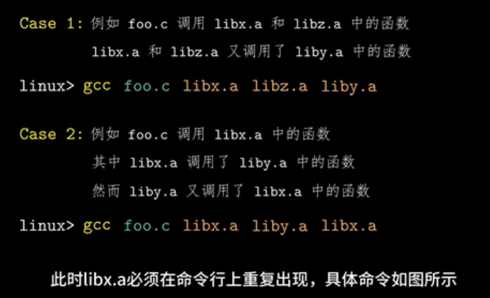

#### 6. 重定位

- 重定位节（段）

  

- 重定位符号引用

  

  这一步需要依赖可重定位条目

  **可重定位条目：**

  - 当汇编器遇到最终位置不确定的符号引用时，就产生一个重定位条目，用来告诉链接器在合成可执行文件时应该如何修改这个引用
  - 关于代码的重定位条目放在.rel.text中
  - 关于已初始化数据的重定位条目放在.rel.data中
  - 

**（1）重定位相对引用：**（以callq为例：）

**（2）重定位绝对引用：**（以mov为例）

重定位后，就可以确定text段和data段的内容

#### 7. 可执行文件

加载到内存的一般只有代码段和数据段

**代码段：**

**数据段：**

**加载进内存：**

#### 8. 动态链接共享库

gcc -shared -fpic -o libvector.so addvec.c mulvec.c

-fpic 表示位置无关

### 第八章 异常控制流

#### 1. 异常控制流

非本地跳转：违反通常的调用/返回栈规则的跳转，在C语言中是通过函数setjmp和longjmp实现的

异常表地址：存放在一个基址寄存器中

硬件触发异常后，剩下的工作由异常处理程序在软件中执行，执行完成后由以下3种情况：

#### 2. 异常

分为4类

| 类型 | 同步/异步 |      返回位置      |         例子          |
| :--: | :-------: | :----------------: | :-------------------: |
| 中断 |   异步    |  返回到下一条指令  |        外部IO         |
| 陷阱 |   同步    |  返回到下一条指令  |       系统调用        |
| 故障 |   同步    | 可能返回到当前指令 |         缺页          |
| 终止 |   同步    |       不返回       | 硬件错误、除0、段错误 |

同步和异步的区别：异常产生的原因来自于内部还是外部

x86-64有256种异常，其中0-31有芯片架构师定义，其余由操作系统定义

#### 3. 进程与上下文

并发是交替进行的，并行是同时运行的

内核模式与用户模式

**上下文：**

- 重新启动一个被抢占的进程所需的状态，包括通用目的寄存器、浮点寄存器、程序计数器、用户栈、状态寄存器、内核栈和各种内核数据结构（页表、包含当前进程信息的进程表、进程打开的文件信息表等）

- 内核调度进程：上下文切换

  - 保存当前进程的上下文
  - 恢复某个先前被抢占进程的上下文
  - 将控制传递给这个新恢复的进程

  

  

#### 4. 进程的创建

**进程的状态：**

**Parent vs Child**

- 调用一次，返回两次
- 并发执行
- 相同但是独立的地址空间
- 共享文件

**fork：**

#### 5. 函数execve和函数waitpid

- 函数execve

  - 调用后不会返回
  - 
    - argv[0]是可执行程序的名字
    - 
  - 

- **函数waitpid**

  - 当一个进程由于某种原因终止时，内核并不是立即把它从系统中清除，而是保持在一种已终止的状态中，直到被它的父进程回收。

  - 终止了但没回收：僵死进程（**zombie**）

  - Linux系统中父进程可以通过函数waitpid来等待它的子进程终止或停止

  - 

    - pid > 0  则为子进程的pid

    - pid = -1 表示等待的进程是由父进程创建的所有子进程组成的集合

    - statusp非空，则会在上面放上导致返回的子进程的状态信息

      

  - 

  

#### 6. 信号 

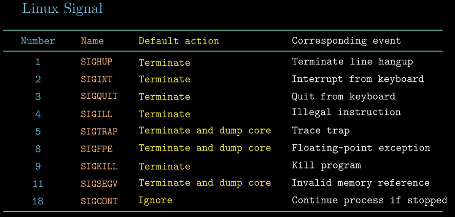

**Precess Groups**

pid_t getpgrp(void): 获取当前进程的组id

pid_t setpgrp(pid_t pid, pid_t pgid): 设置进程所属进程组。（0表示当前进程（组））

**Sending Signals**

- 通过kill：

  - 向进程15213发送信号：/bin/kill -9 15213
  - 向进程组15213发送信号：/bin/kill -9 -15213

- 通过键盘

  

- 通过kill函数：

  - 
    - pid > 0  发送信号给特定进程
    - pid = 0  发送信号给所在进程组的所有进程（包括自己）
    - pid < 0  发送信号给进程组|pid|中的每个进程

- alarm函数

  - 自己给自己发SIGALRM
  - 

**Receiving Signals**

在任何时刻，一种类型的信号最多只会有一个待处理信号

信号处理程序可以被其他信号处理程序中断

只有当一个变量是一个全局变量时，extern变量才会起作用

#### 7. 非本地跳转

goto是在函数内部进行系统跳转；setjmp/longjmp可以在函数间跳转

**int setjmp(jmp_buf j)**

- 必须在longjmp之前被调用
- 保存当前调用环境，供后续 longjmp使用
- ==被调用一次，返回多次==

**void longjmp(jmp_buf j, int i)**

- 含义:从缓冲区**j**中恢复调用环境，并触发 **setjmp** 返回非零的返回值 **i**
- 在setjmp之后被调用
- ==被调用一次，从不返回==

### 第九章 虚拟内存

#### 1. 概述

- 虚拟内存是核心的
- 虚拟内存是强大的
- 虚拟内存是危险的

**虚拟页面看分为3类**

- 未分配：不占空间

- 已缓存

- 未缓存

  

存储：

- SRAM 缓存：L1 Cache  L2 Cache  L3Cache

- DRAM 缓存：主存中的虚拟页。采用**写回策略**（磁盘访问时间长）

- SRAM比DRAM快10倍，磁盘大约比DRAM慢10万倍

  DRAM缓存采用全相联；与cache的替换算法相比，DRAM的替换算法更加复杂（不重要）

#### 2. 地址翻译

- 页表基址寄存器：存页表起始地址
- PTE：页表项
- PTEA：页表项地址（根据页表基址和虚拟页号得到）
- 

**翻译：**

- 页面命中

  > 

- 缺页

  > 
  >
  > MMU获得页表项之后，发现有效位为0，触发缺页异常

- 有Cache和地址转换时，一般是先进行地址转换再访问Cache

  > 
  >
  > 上半部分为根据VA获取PTE，下半部分为根据PA获取数据

- 加了TLB(基于组相联)

  > 

#### 3. 缺页处理、内存映射

> 

##### 内存映射

Linux虚拟内存区域可以映射到**普通文件和匿名文件**(内核创建，全是二进制零，一旦该页面被修改，即和其他页面一样)，这两种类型的对象中的一种。

- 共享对象
- 私有的写时复制
- fork
- execve
- mmap

#### 4. 动态分配

[(23条消息) 计算机系统课程 笔记总结 CSAPP第九章 虚拟存储器（9.6-9.10）_为什么说tlb未命中很少见_頔潇的博客-CSDN博客](https://blog.csdn.net/gzn00417/article/details/104237089)

- 隐式内存分配

  >

  - 分配算法

    - 首次适配
    - 下一次适配
    - 最佳适配

  - 分配空闲块：分割

  - 是否一个空闲块：清除已分配（allocated）标志；合并（立即合并、推迟合并）

    

- 显示内存分配

  > 

  - 将新释放的块合并后放置在链表的开始处

- 分离的空闲链表

  每个大小类中的块构成一个空闲链表

  > 

- 按照尺寸排序的块

#### 5. 垃圾收集

自动回收堆存储的过程：应用从不显式释放

把内存当作有向图，块为节点，指针为边；

可达节点 ：存在一条从任意根节点出发并到达该节点的有向路径；

不可达节点是垃圾(不能被应用再次使用)

### 第十章 系统级IO

## 课件习题

### 第一章

- 

### 第二章

- 
- 
- 

### 第三章

- 
- 
- 
- 
- 
- 
- 
- 
- 

### 第四章

- 
- 
- 
- 
- 
- 

### 第五章

- 

### 第七章

- 

### 第八章

- 
  - 地址需要考虑大小端，字符串不需要
- 
- 

### 第十章

- 

